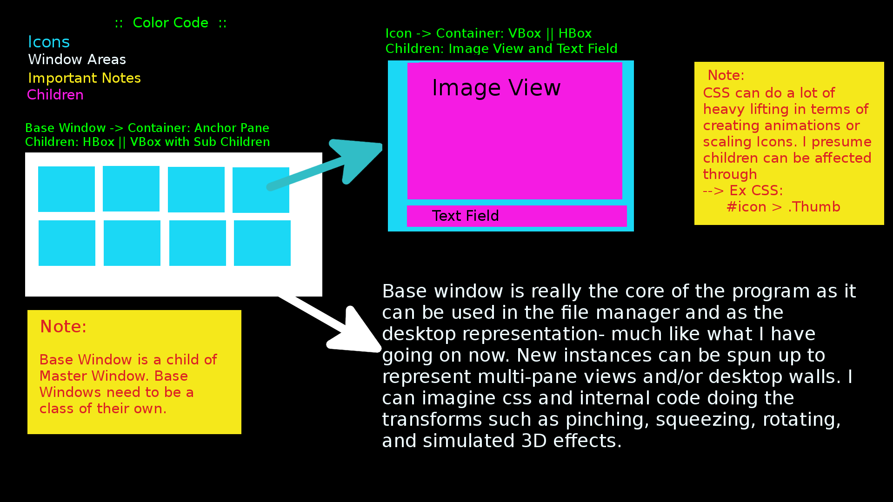
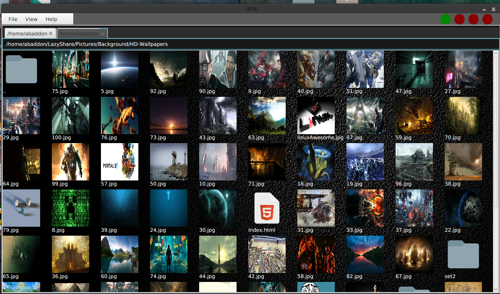
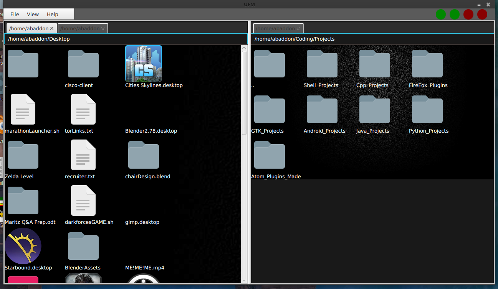
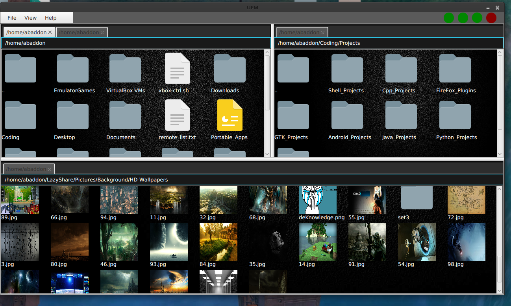
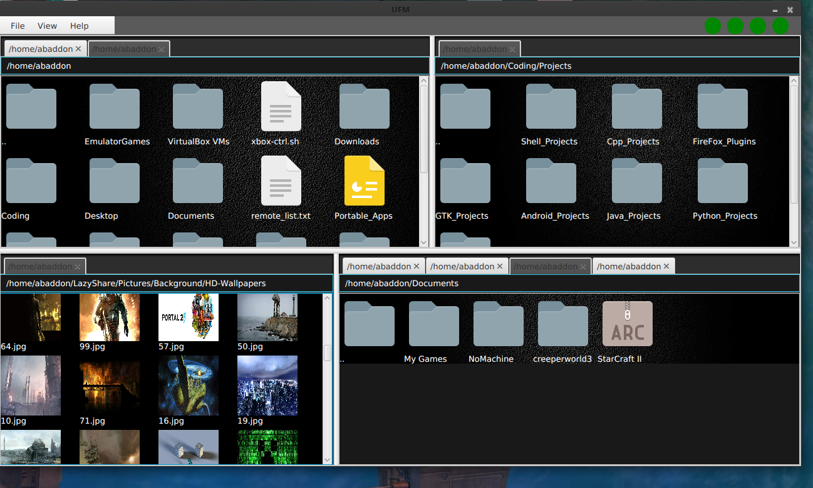

# UDE
UDE is a Java desktop environment that has both a file manager and desktop.
 
<h2>Goals:</h2>

1. Make an easily customizable desktop environment. 
2. Allow for fancy effects. 
3. Mimic some of the old effects such as cube selection, grid wall selection, etc.  
4. Push the boundaries of what we consider a desktop. Try aiming for a 3D environment or just do something unique.
 
<h2>Current Phase:</h2>

Fixing up directory structure and setting up for Jar creation. UFM completed and UDE needs it next.
I might just use UFM's code to do the desktop than a separate Jar.
  
<h2>Todo List:</h2>

2. Pretty much re-write everything. 
3. Focus on modularity.
 
<h2>Images</h2>

  

